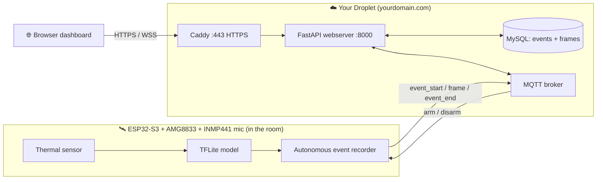

# PresenceObserver — Droplet Deployment Guide

A step-by-step, **beginner-friendly** guide to running the whole suite (ESP32
firmware + MQTT broker + FastAPI server + MySQL + web dashboard) on a fresh
DigitalOcean droplet with your own domain and HTTPS.

This guide assumes **you have never done this before**. Every step explains
*what* you're doing and *why*. Copy-paste the commands, but read the "why" boxes
so you actually learn.

> **Convention:** commands that run **on the droplet** are shown as shell
> blocks. Replace `yourdomain.com`, `YOUR_DROPLET_IP`, and any password
> placeholder with your real values everywhere they appear.

---

## Table of contents

1. [The big picture](#1-the-big-picture)
2. [What you need before starting](#2-what-you-need-before-starting)
3. [Step 1 — Create the droplet](#step-1--create-the-droplet)
4. [Step 2 — Point your domain at the droplet (DNS)](#step-2--point-your-domain-at-the-droplet-dns)
5. [Step 3 — First login & create a non-root user](#step-3--first-login--create-a-non-root-user)
6. [Step 4 — Harden the server (firewall, SSH, auto-updates)](#step-4--harden-the-server)
7. [Step 5 — Install Docker & Docker Compose](#step-5--install-docker--docker-compose)
8. [Step 6 — Get the code onto the droplet](#step-6--get-the-code-onto-the-droplet)
9. [Step 7 — Choose & set up your MQTT broker](#step-7--choose--set-up-your-mqtt-broker)
    - [Option A — Self-hosted Mosquitto (recommended)](#option-a--self-hosted-mosquitto-recommended)
    - [Option B — Free public/cloud MQTT (HiveMQ Cloud)](#option-b--free-publiccloud-mqtt-hivemq-cloud)
10. [Step 8 — Configure environment variables (`.env`)](#step-8--configure-environment-variables-env)
11. [Step 9 — Configure Caddy (HTTPS reverse proxy)](#step-9--configure-caddy-https-reverse-proxy)
12. [Step 10 — Launch the stack](#step-10--launch-the-stack)
13. [Step 11 — Flash & point the ESP32 at your server](#step-11--flash--point-the-esp32-at-your-server)
14. [Step 12 — Verify everything end-to-end](#step-12--verify-everything-end-to-end)
15. [Codebase improvements (do these after it's live)](#codebase-improvements)
16. [Cheat sheet](#cheat-sheet)

---

## 1. The big picture

Before touching anything, understand the shape of what you're building.



**What the device does (autonomous):** it monitors on its own at 1 Hz. When it
detects a person it *immediately* logs an event (the dashboard notifies at that
instant) and records a thermal clip at 1 fps until the area is empty (capped at
5 minutes). Each frame carries an optional sound level from the INMP441 mic. The
only command it accepts back is the **arm/disarm** "off switch" from the web UI.

**The jargon, explained once:**

| Term | Plain-English meaning |
|------|----------------------|
| **Droplet** | A rented Linux computer in a data center (DigitalOcean's word for a virtual server / VPS). |
| **Docker** | A way to package each program (server, database, broker) into an isolated "container" so it runs the same everywhere and doesn't mess up the host. |
| **Docker Compose** | A single file (`docker-compose.yml`) that describes several containers and runs them together with one command. |
| **MQTT** | A lightweight messaging system for devices. Programs **publish** messages to a named **topic**, and others **subscribe** to that topic to receive them. A **broker** is the middleman that routes messages. Think of it as a group chat where topics are channel names. |
| **Reverse proxy (Caddy)** | A program that sits in front of your app, terminates HTTPS (encryption), and forwards traffic to the app. Caddy also gets free TLS certificates automatically. |
| **TLS / HTTPS / WSS** | Encryption. `https://` = encrypted web, `wss://` = encrypted WebSocket. The padlock in the browser. |
| **DNS / A record** | The phonebook of the internet. An **A record** maps `yourdomain.com` → your droplet's IP address. |
| **WebSocket** | A live, two-way connection between browser and server (used here to stream the heatmap in real time). |

**How data flows once it's live:**

```
Person walks into view
      │
      ▼
  ESP32 (monitoring at 1 Hz) confirms presence
      │  publishes event_start to  …/event      ← fires instantly
      │  then one frame per second to  …/frame  (until empty, max 5 min)
      │  then event_end to  …/event
      ▼
  FastAPI (subscribed to …/event and …/frame)
      ├─► PERSISTS events + frames into MySQL
      └─► pushes live notifications/frames to the browser over WebSocket
              → toast at detection · events table · heatmap playback

  Operator toggles the arm switch
      │  HTTPS POST /api/arm  →  FastAPI publishes arm|disarm to  …/command
      ▼
  ESP32 suspends/resumes monitoring and reports its state back on  …/event
```

### Repository map & components

```
PresenseObserver/
├── esp32/
│   ├── thermal/            # MAIN firmware — sensor + on-device TFLite + MQTT
│   └── ESP32-feather/      # Diagnostic sketch — WiFi/sensor troubleshooting only
└── server/                 # FastAPI + MySQL, dockerized
    └── webserver/          # app code, static assets, HTML template
```

Two separate PlatformIO projects, both targeting `adafruit_feather_esp32s3`.

**`esp32/thermal/` — the real pipeline node.** Reads the AMG8833 8×8 thermal
camera, turns the 64 raw pixels into a **76-feature** vector (64 z-scored pixels
+ hand-crafted stats: max/range, counts above median+3/+5, gradient energy,
largest hot blob, quadrant variance, center-vs-outer contrast, row/col-max
spread — standardized with `SCALER_MEAN`/`SCALER_SCALE`), runs a TensorFlow Lite
Micro model (8 KB arena) to output a confidence in `[0,1]` (`>0.5` = PRESENT).
It runs **autonomously**: a debounced presence transition starts an event and
streams frames (see the data-flow above). An optional **INMP441 I2S microphone**
(`Microphone` module, `-D USE_MIC`) adds a sound level per frame; the firmware
runs fine without it. `armed` state is persisted in NVS. Helper classes:
`ECE140_WIFI` (multi-SSID failover + WPA2-Enterprise + captive-portal recovery)
and `ECE140_MQTT` (PubSubClient wrapper that survives reconnects). Secrets come
from `.env` at build time via `pre_extra_script.py`; **the broker host is
hardcoded** in `include/ECE140_MQTT.h`.

**`esp32/ESP32-feather/` — diagnostics only** (no ML, no MQTT). WiFi scan, join
`RESNET-GUEST-DEVICE`, captive-portal check, AMG8833 I2C detection.

**`server/` — FastAPI + MySQL.** Subscribes to `…/event` and `…/frame`,
**persists** events + frames, relays the arm/disarm command to `…/command`, and
broadcasts live notifications/frames to browsers over a WebSocket. Exposes REST
for events (list, frames, false-alarm, delete), the arm switch, plus the legacy
readings/devices CRUD.

**MQTT payloads:**
```jsonc
// <MQTT_TOPIC>/event  — event_start (fires at detection)
{ "type": "event_start", "event_uid": "AA:BB..-12345", "mac_address": "AA:BB:...",
  "trigger_confidence": 0.91, "audio_level": 0.12 }
// <MQTT_TOPIC>/frame  — one per second while recording
{ "event_uid": "AA:BB..-12345", "seq": 0, "pixels": [64 floats],
  "thermistor": 25.31, "confidence": 0.88, "audio_level": 0.10 }
// <MQTT_TOPIC>/event  — event_end, and device state reports
{ "type": "event_end", "event_uid": "AA:BB..-12345", "frame_count": 42 }
{ "type": "state", "mac_address": "AA:BB:...", "armed": true }
```

**Database schema** (auto-created on server startup):
- `devices(id, mac_address UNIQUE, created_at)`
- `events(id, event_uid UNIQUE, mac_address FK, trigger_confidence, audio_level,
  started_at, ended_at, frame_count, false_alarm, note, created_at)`
- `event_frames(id, event_id FK ON DELETE CASCADE, seq, pixels JSON, thermistor,
  confidence, audio_level, captured_at)`
- `readings(...)` — legacy, retained but no longer written by the device.

---

## 2. What you need before starting

- A **DigitalOcean account** (or any VPS provider — the steps are 95% identical on AWS Lightsail, Linode, Hetzner, etc.).
- A **domain name** you control (e.g. bought from Namecheap, Cloudflare, Porkbow, Google Domains).
- An **SSH key pair** on your own computer. Check if you have one:
  ```bash
  ls ~/.ssh/id_ed25519.pub
  ```
  If that file doesn't exist, create one (press Enter through the prompts):
  ```bash
  ssh-keygen -t ed25519 -C "you@example.com"
  ```
  > **Why SSH keys?** A key is a long cryptographic secret that's far safer than
  > a password — it can't be guessed or brute-forced. You keep the *private*
  > key; the server holds the *public* half.

---

## Step 1 — Create the droplet

1. In DigitalOcean: **Create → Droplets**.
2. **Image:** Ubuntu **24.04 LTS** (LTS = long-term support, stable).
3. **Size:** pick at least **2 GB RAM** (the "Basic" $12/mo tier).
   > **Why not the cheapest?** MySQL 8 alone wants ~400 MB, plus the Python
   > server, plus Docker overhead. On a 1 GB droplet it works but is tight; on
   > 512 MB it will crash under load. 2 GB gives you breathing room.
4. **Authentication:** choose **SSH Key** and add the public key from Step 2's
   prerequisite (paste the contents of `~/.ssh/id_ed25519.pub`). Avoid the
   password option.
5. **Hostname:** name it something like `presence-observer`.
6. Click **Create**. After ~30 seconds you'll get a public **IP address** —
   copy it. This is `YOUR_DROPLET_IP`.

---

## Step 2 — Point your domain at the droplet (DNS)

Go to wherever you manage your domain's DNS and create records:

| Type | Name | Value | Meaning |
|------|------|-------|---------|
| `A` | `@` | `YOUR_DROPLET_IP` | `yourdomain.com` → droplet |
| `A` | `www` | `YOUR_DROPLET_IP` | `www.yourdomain.com` → droplet |

> **Why this matters for HTTPS:** Caddy proves it owns the domain by answering a
> challenge at that domain. If DNS doesn't point here yet, certificate issuance
> fails. DNS changes can take a few minutes (up to an hour) to propagate.

Verify it resolves (run on your own machine):
```bash
dig +short yourdomain.com
```
It should print `YOUR_DROPLET_IP`.

---

## Step 3 — First login & create a non-root user

Log in as root using your key:
```bash
ssh root@YOUR_DROPLET_IP
```

Working as `root` (the all-powerful account) full-time is risky — one typo can
wipe the system. Create a normal user with `sudo` (admin-when-needed) rights:

```bash
adduser deploy                 # pick a password when prompted
usermod -aG sudo deploy        # grant sudo
rsync --archive --chown=deploy:deploy ~/.ssh /home/deploy
```
> The last line copies your SSH key to the new user so you can log in as them.

Now log out and back in as the new user:
```bash
exit
ssh deploy@YOUR_DROPLET_IP
```
From here on, everything is done as `deploy`, using `sudo` for admin tasks.

---

## Step 4 — Harden the server

A public server is constantly scanned by bots. These four measures block the
overwhelming majority of attacks.

### 4a. Firewall (UFW) — only open the ports you actually use

```bash
sudo ufw default deny incoming     # block everything inbound by default
sudo ufw default allow outgoing    # allow the server to reach out
sudo ufw allow OpenSSH             # port 22 (so you don't lock yourself out!)
sudo ufw allow 80/tcp              # HTTP  (Caddy needs it to get certs + redirect)
sudo ufw allow 443/tcp             # HTTPS (the actual site)
sudo ufw enable                    # turn it on (confirm with 'y')
sudo ufw status                    # review
```

> **Notice what's NOT open:** MySQL (3306) and the app (8000) are *not* exposed.
> They only need to talk to each other *inside* Docker's private network, so the
> outside world can never reach them directly. This is a core security idea:
> **expose the minimum.**
>
> **If you self-host Mosquitto** and want the ESP32 to reach it from outside,
> you'll also `sudo ufw allow 8883/tcp` (TLS MQTT) — covered in Step 7.

### 4b. Lock down SSH

Edit the SSH config:
```bash
sudo nano /etc/ssh/sshd_config
```
Set these lines (find and change them, or add them):
```
PermitRootLogin no
PasswordAuthentication no
```
Save (`Ctrl+O`, Enter, `Ctrl+X`), then restart SSH:
```bash
sudo systemctl restart ssh
```
> **Why:** disabling password login means attackers can't brute-force their way
> in — they'd need your private key, which they don't have. **Test that you can
> still log in from a second terminal before closing this one.**

### 4c. Fail2ban — auto-ban repeat offenders

```bash
sudo apt update && sudo apt install -y fail2ban
```
It watches logs and temporarily bans IPs that fail login repeatedly. Works out
of the box for SSH.

### 4d. Automatic security updates

```bash
sudo apt install -y unattended-upgrades
sudo dpkg-reconfigure -plow unattended-upgrades   # choose "Yes"
```
> Keeps the OS patched against known vulnerabilities without you remembering to.

---

## Step 5 — Install Docker & Docker Compose

Install Docker from its official repository (the Ubuntu default package is
often outdated):

```bash
# 1. Install prerequisites and Docker's signing key
sudo apt update
sudo apt install -y ca-certificates curl gnupg
sudo install -m 0755 -d /etc/apt/keyrings
curl -fsSL https://download.docker.com/linux/ubuntu/gpg | \
  sudo gpg --dearmor -o /etc/apt/keyrings/docker.gpg
sudo chmod a+r /etc/apt/keyrings/docker.gpg

# 2. Add Docker's repository
echo "deb [arch=$(dpkg --print-architecture) signed-by=/etc/apt/keyrings/docker.gpg] \
  https://download.docker.com/linux/ubuntu $(. /etc/os-release && echo $VERSION_CODENAME) stable" | \
  sudo tee /etc/apt/sources.list.d/docker.list > /dev/null

# 3. Install Docker Engine + Compose plugin
sudo apt update
sudo apt install -y docker-ce docker-ce-cli containerd.io docker-buildx-plugin docker-compose-plugin

# 4. Let 'deploy' run docker without sudo
sudo usermod -aG docker deploy
```

Log out and back in (so the group change takes effect), then verify:
```bash
exit
ssh deploy@YOUR_DROPLET_IP
docker run hello-world          # should print a success message
docker compose version          # should print a version
```

---

## Step 6 — Get the code onto the droplet

Install git and clone your repo:
```bash
sudo apt install -y git
cd ~
git clone https://github.com/DanielNg520/PresenseObserver.git
cd PresenseObserver/server
```
> If your repo is private, either use a **deploy key** (a read-only SSH key for
> this server) or clone over HTTPS with a personal access token. For a public
> repo the command above just works.

---

## Step 7 — Choose & set up your MQTT broker

This is the messaging backbone. **The current code points at a public broker
(`broker.emqx.io`)** — fine for a class demo, but on a live server it means
*anyone who knows your topic name can read your data and send commands to your
device.* You have two better paths. Pick one.

```
                    Which broker should I use?
                              │
        ┌─────────────────────┴──────────────────────┐
        ▼                                             ▼
 I want full control,                        I don't want to run a
 privacy, no third party            or       broker; a managed free
 → Option A: Mosquitto                        tier is fine
   (runs on YOUR droplet)                    → Option B: HiveMQ Cloud
```

---

### Option A — Self-hosted Mosquitto (recommended)

You run your **own** broker as another Docker container next to the server.
Nobody else can see your topics, and you control the passwords.

**A1. Create the config folders:**
```bash
cd ~/PresenseObserver/server
mkdir -p mosquitto/config mosquitto/data mosquitto/log
```

**A2. Write the broker config** — `mosquitto/config/mosquitto.conf`:
```bash
nano mosquitto/config/mosquitto.conf
```
```conf
# Listener for other containers on the internal Docker network (plaintext,
# safe because it never leaves the private network).
listener 1883
allow_anonymous false
password_file /mosquitto/config/passwd

persistence true
persistence_location /mosquitto/data/
log_dest file /mosquitto/log/mosquitto.log

# TLS listener for the ESP32 coming in from the internet (encrypted).
listener 8883
cafile   /mosquitto/config/certs/ca.crt
certfile /mosquitto/config/certs/server.crt
keyfile  /mosquitto/config/certs/server.key
```
> **What this says:** accept internal connections on 1883 and external
> encrypted ones on 8883; require a username/password; refuse anonymous clients.

**A3. Create a broker username/password.** We use the mosquitto image itself to
generate the password file:
```bash
# Create an empty file first
touch mosquitto/config/passwd

# Add a user (you'll be prompted for a password). Replace 'espuser'.
docker run --rm -it -v "$PWD/mosquitto/config:/mosquitto/config" \
  eclipse-mosquitto:2 mosquitto_passwd /mosquitto/config/passwd espuser
```
Remember this username + password — the ESP32 and the FastAPI server will both
use it.

**A4. Add Mosquitto to `docker-compose.yml`.** Add this service under
`services:` (same indentation as `db` and `webserver`):
```yaml
  mqtt:
    image: eclipse-mosquitto:2
    restart: unless-stopped
    ports:
      - "8883:8883"            # TLS port, exposed for the ESP32
    volumes:
      - ./mosquitto/config:/mosquitto/config
      - ./mosquitto/data:/mosquitto/data
      - ./mosquitto/log:/mosquitto/log
```
> The internal `1883` is **not** published to the host — only other containers
> (the webserver) reach it via the name `mqtt`. Only the encrypted `8883` faces
> the internet, and remember to `sudo ufw allow 8883/tcp`.

**A5. TLS certificates for 8883.** The simplest robust approach is to reuse the
certs Caddy already obtains, or generate a self-signed CA for device-only use.
For a first pass, a **self-signed cert** is fine because *you* control both ends
(the ESP32 and the broker):
```bash
mkdir -p mosquitto/config/certs && cd mosquitto/config/certs
# CA (your own mini certificate authority)
openssl req -new -x509 -days 3650 -nodes -keyout ca.key -out ca.crt -subj "/CN=PresenceCA"
# Server key + cert signed by your CA (CN MUST match how the ESP32 addresses it)
openssl req -new -nodes -keyout server.key -out server.csr -subj "/CN=yourdomain.com"
openssl x509 -req -in server.csr -CA ca.crt -CAkey ca.key -CAcreateserial -out server.crt -days 3650
cd ~/PresenseObserver/server
```
> You'll copy `ca.crt` into the ESP32 firmware so it trusts your broker.
> (See Step 11 for the firmware-side change.)

**A6. Point the server at the local broker.** In your `.env` (next step) set:
```
MQTT_BROKER=mqtt          # the docker service name, resolved on the internal network
```
The server connects on plaintext 1883 *inside* Docker — safe, never leaves the host.

**Trade-offs of Option A:**
- ✅ Private, no third party, no message limits, full control.
- ✅ Free (runs on hardware you're already paying for).
- ⚠️ You maintain it (updates, certs). Certs above are self-signed, so browsers
  won't trust them — but that's irrelevant here because only your own devices
  connect to the broker, not browsers.

---

### Option B — Free public/cloud MQTT (HiveMQ Cloud)

If you'd rather not run a broker, a **managed cloud broker** gives you a private,
authenticated, TLS-encrypted broker without server maintenance. **HiveMQ Cloud**
has a free "Serverless" tier (up to 100 connections / small throughput — plenty
for this project). Alternatives with free tiers: **EMQX Cloud Serverless**,
**flespi**, **Mosquitto's public test broker** (test.mosquitto.org — *no
privacy, demo only*).

> **Important distinction:** HiveMQ Cloud's free tier is **private to you**
> (username + password + TLS). That's completely different from the *public test
> brokers* (`broker.emqx.io`, `test.mosquitto.org`) where anyone can read your
> topics. **Never run production on a public test broker.**

**B1. Sign up** at hivemq.com → HiveMQ Cloud → create a free **Serverless**
cluster. You'll get:
- A **host** like `abcdef123.s1.eu.hivemq.cloud`
- A **port**: `8883` (TLS)

**B2. Create credentials.** In the cluster's **Access Management**, add a
username + password. This is what your ESP32 and server will authenticate with.

**B3. Point the server at it.** In `.env`:
```
MQTT_BROKER=abcdef123.s1.eu.hivemq.cloud
```
Because HiveMQ requires **TLS + auth on port 8883**, the current server code
(which connects on plaintext 1883 with no credentials) needs a small change.
See [Codebase improvements → MQTT auth/TLS](#improvement-6--mqtt-auth-and-tls)
for the exact edits. In short you'll:
- set the port to 8883,
- call `mqtt_client.tls_set()` and `mqtt_client.username_pw_set(user, pass)`
  in `main.py` before connecting,
- and do the equivalent (`WiFiClientSecure` + credentials) in the firmware.

**Trade-offs of Option B:**
- ✅ Zero maintenance, TLS + auth handled for you, works from anywhere.
- ✅ Free tier is enough for this project.
- ⚠️ A third party technically transports your (encrypted) messages.
- ⚠️ Free tiers have connection/throughput caps and can change terms.

**Which should you pick?** If you already have the droplet and want to learn how
the plumbing works → **Option A (Mosquitto)**. If you want the fastest reliable
path and less to maintain → **Option B (HiveMQ Cloud)**.

---

## Step 8 — Configure environment variables (`.env`)

The app reads secrets and settings from a `.env` file it never commits to git.
Create it in the `server/` folder:

```bash
cd ~/PresenseObserver/server
nano .env
```
```dotenv
# --- Database ---
DB_HOST=db
DB_PORT=3306
DB_USER=root
DB_PASSWORD=CHANGE_ME_to_a_long_random_password
DB_NAME=ta7db

# --- MQTT ---
# Option A (Mosquitto): use the service name 'mqtt'
# Option B (HiveMQ):    use your cluster host, e.g. abcdef.s1.eu.hivemq.cloud
MQTT_BROKER=mqtt
MQTT_TOPIC=presence/yourname/thermal-suite
```
> **Pick a unique `MQTT_TOPIC`.** On any shared broker the topic is effectively
> your "address" — make it non-obvious. The server derives `…/command` and
> `…/thermal` subtopics from it automatically.
>
> **Generate a strong DB password:**
> ```bash
> openssl rand -base64 24
> ```

Lock the file down so only you can read it:
```bash
chmod 600 .env
```

---

## Step 9 — Configure Caddy (HTTPS reverse proxy)

You said you already have Caddy on the droplet. The key config is telling it to
forward your domain to the webserver container and to **upgrade WebSockets**
(Caddy does this automatically). Your `Caddyfile` needs an entry like:

```caddy
yourdomain.com {
    reverse_proxy webserver:8000
}
```

Two ways to wire Caddy to the container:

- **If Caddy runs as a Docker container**, put it on the same Compose project /
  network so the name `webserver` resolves. Add a `caddy` service to
  `docker-compose.yml`:
  ```yaml
    caddy:
      image: caddy:2
      restart: unless-stopped
      ports:
        - "80:80"
        - "443:443"
      volumes:
        - ./Caddyfile:/etc/caddy/Caddyfile
        - caddy_data:/data
        - caddy_config:/config
      depends_on:
        - webserver
  ```
  and add `caddy_data:` and `caddy_config:` under the top-level `volumes:` key.

- **If Caddy runs directly on the host** (installed via apt), it can't use the
  container name. Instead, publish the webserver on localhost only and proxy to
  that. In `docker-compose.yml` give the webserver `ports: ["127.0.0.1:8000:8000"]`
  and set the Caddyfile to `reverse_proxy 127.0.0.1:8000`.

> **Why a reverse proxy at all?** The FastAPI app speaks plain HTTP. Exposing
> that to the internet is insecure. Caddy sits in front, gets a free Let's
> Encrypt certificate for `yourdomain.com`, encrypts everything, and forwards
> the decrypted request inward. It also transparently handles the `wss://`
> WebSocket upgrade your live heatmap needs.

---

## Step 10 — Launch the stack

From the `server/` folder:
```bash
docker compose up --build -d
```
- `--build` builds the webserver image from its Dockerfile.
- `-d` = detached (runs in the background).

Check everything is healthy:
```bash
docker compose ps          # all services should be "running"/"healthy"
docker compose logs -f webserver  # follow the webserver logs (Ctrl+C to stop watching)
```
Look for the MQTT `Connected` and `Subscribed to …/event` / `…/frame` log lines.

Visit **https://yourdomain.com** — you should see the dashboard with a green
"Connected" badge (the WebSocket is live). No readings yet — that needs the
ESP32.

---

## Step 11 — Flash & point the ESP32 at your server

The firmware lives in `esp32/thermal/`. Do this from **your own computer** (with
the board plugged in via USB), not the droplet.

**11a. Firmware `.env`** — in `esp32/thermal/.env` (copy from the example), set
your WiFi and the **same** MQTT topic as the server:
```dotenv
WIFI_SSID=YourWiFiName
NON_ENTERPRISE_WIFI_PASSWORD=YourWiFiPassword
UCSD_USERNAME=
UCSD_PASSWORD=
MQTT_CLIENT_ID=esp32-thermal-01
MQTT_TOPIC=presence/yourname/thermal-suite
```
> The firmware auto-chooses Enterprise vs. normal WiFi: if
> `NON_ENTERPRISE_WIFI_PASSWORD` is <2 chars it tries WPA2-Enterprise with the
> `UCSD_*` fields; otherwise it uses the normal password. Fill the set you need.

**11b. Point the firmware at your broker.** The broker host is currently
hardcoded in `esp32/thermal/include/ECE140_MQTT.h`:
```cpp
const char* _broker = "broker.emqx.io";
```
Change it to:
- **Option A (Mosquitto):** your droplet's domain, `yourdomain.com`, and use the
  TLS port `8883` (see the TLS note below).
- **Option B (HiveMQ):** your cluster host, e.g. `abcdef.s1.eu.hivemq.cloud`,
  port `8883`.

> **Plaintext vs TLS on the device:** the shipped `ECE140_MQTT` uses a plain
> `WiFiClient` on port 1883 with no credentials. To reach a secured broker
> (either option's 8883) you must switch to `WiFiClientSecure`, load the CA
> certificate, and set username/password. This is the firmware half of
> [Improvement 6](#improvement-6--mqtt-auth-and-tls) — do that before relying on
> it in the field. For a first local test you can keep 1883 against Mosquitto's
> internal listener if the board is on the same LAN, but don't leave it that way.

**11c. (Optional) Wire the INMP441 microphone.** The mic is redundant — skip it
and the firmware still works. To use it, wire it and keep `-D USE_MIC` in
`platformio.ini` (default on):

| INMP441 | ESP32-S3 | Notes |
|---------|----------|-------|
| VDD | 3V3 | |
| GND | GND | |
| L/R | GND | selects the left I2S slot |
| WS  | GPIO12 | `MIC_WS`  (override with `-D MIC_WS=`) |
| SCK | GPIO13 | `MIC_SCK` |
| SD  | GPIO14 | `MIC_SD` |

To build without the mic, comment out `-D USE_MIC` in `esp32/thermal/platformio.ini`.

**11d. Flash and monitor** (from `esp32/thermal/`):
```bash
pio run --target upload --target monitor -e adafruit_feather_esp32s3
```
Watch the serial output for `Connected to WiFi`, `MQTT Connected`,
`Microphone available` (or "not available"), and
`Ready — monitoring ARMED`.

---

## Step 12 — Verify everything end-to-end

1. Dashboard open at `https://yourdomain.com`, badge shows **Connected**, and
   the arm switch shows **Armed**.
2. Serial monitor shows the ESP32 connected to WiFi + MQTT and `monitoring ARMED`.
3. **Walk in front of the sensor.** Within ~2 s the serial log prints
   `[Event] START …` then one `[MQTT] Publishing … /frame` per second.
4. On the dashboard: a **toast** appears the instant it detects you, a new row
   shows in **Presence events** with a growing frame count, and the summary
   metrics update.
5. Leave the view (or wait for the 5-min cap): serial prints `[Event] END …`
   and the event's duration/frame count finalize.
6. Click **Play** on the event → the heatmap animates through the recorded clip.
   Click **Mark false alarm** → the badge flips and persists across reload.
7. Toggle the arm switch **off** → serial prints `[Cam] DISARMED`, the live card
   dims to "Monitoring paused", and no new events record. Toggle back on to resume.

If it doesn't work, debug in this order (each isolates one link in the chain):

```
No dashboard at all         → Caddy / DNS / firewall (Steps 2,4,9)
Dashboard but "Disconnected" → WebSocket / wss (Step 9)
Connected but no events     → MQTT topic mismatch or broker auth (Steps 7,8,11)
Events but arm switch stuck  → device offline; it reports state on reconnect
ESP32 won't connect to MQTT  → broker host/port/credentials/TLS (Step 11)
ESP32 won't connect to WiFi  → firmware .env WiFi settings (Step 11a)
```
Handy: subscribe to your topic from the droplet to see raw traffic (Option A):
```bash
docker compose exec mqtt mosquitto_sub -h localhost -p 1883 \
  -u espuser -P yourpassword -t 'presence/yourname/thermal-suite/#' -v
```

---

# Codebase improvements

**Do these once the basic suite is live.** They're ordered by impact. Each says
*what's wrong now*, *why it matters*, and *what to change* — so you can
implement and learn one at a time. File references point at the current code.

> Some of these have since been applied (marked ✅ DONE); the rest are still
> recommendations. Tackle the open ones in order; each is independent.

---

## Improvement 1 — Add authentication to the API

**Now:** the write/control endpoints — `POST /api/arm` (arm/disarm the camera),
`POST /api/events/{id}/false_alarm`, `DELETE /api/events/{id}`, plus the legacy
`/api/command` and `/api/readings` writes — are open to the entire internet once
the domain is live. Anyone could disarm your camera or delete your event history.

**Why it matters:** these are *write* and *control* actions with no gate — and
one of them now literally turns the camera off. This is the most important
app-level fix.

**Do:** add a simple API-key dependency. Put a secret in `.env`
(`API_KEY=...`) and require it as a header:
```python
from fastapi import Header, Depends

def require_api_key(x_api_key: str = Header(None)):
    if x_api_key != os.getenv("API_KEY"):
        raise HTTPException(status_code=401, detail="Unauthorized")

# then protect the routes:
@app.post("/api/command", dependencies=[Depends(require_api_key)])
```
Send the header from the dashboard's `fetch` calls in `static/script.js`.
Alternatively, gate `/api/*` at the edge with Caddy `basicauth`.

---

## Improvement 2 — Fix the WebSocket scheme for HTTPS  ✅ DONE

`static/script.js` now derives the scheme from the page
(`const scheme = location.protocol === 'https:' ? 'wss' : 'ws'`), so the live
WebSocket works under HTTPS. No action needed.

---

## Improvement 3 — Use a MySQL connection pool

**Now:** `get_db()` ([`main.py:37`](server/webserver/main.py#L37)) opens a
**brand-new database connection on every single request**, and each endpoint
opens/closes its own.

**Why it matters:** opening a TCP + auth handshake per request is slow and, under
concurrency, exhausts MySQL's connection limit. This is your biggest performance
bottleneck.

**Do:** create one pool at startup and borrow from it:
```python
from mysql.connector import pooling

pool = pooling.MySQLConnectionPool(
    pool_name="app", pool_size=5,
    host=DB_HOST, port=DB_PORT, user=DB_USER,
    password=DB_PASSWORD, database=DB_NAME)

def get_db():
    return pool.get_connection()   # returns to pool on .close()
```

---

## Improvement 4 — Index and paginate readings

**Now:** `GET /api/readings` ([`main.py:227`](server/webserver/main.py#L227))
does `SELECT *` with no `LIMIT`, and filters by `mac_address` with no index.

**Why it matters:** once the `readings` table grows to thousands of rows, the
page load and the MAC filter get slow (full table scans), and the unbounded
select can return huge payloads.

**Do:**
- Add an index (run once in MySQL):
  ```sql
  CREATE INDEX idx_readings_mac_time ON readings (mac_address, created_at);
  ```
- Add `ORDER BY created_at DESC LIMIT %s OFFSET %s` and expose `?limit=&offset=`
  query params.

---

## Improvement 5 — Persist detections automatically  ✅ DONE (events)

Presence **events and their frames are now persisted** to MySQL by `on_message`
(`insert_event` / `insert_frame` / `finalize_event`), inside a `try/except` so a
DB hiccup can't kill the MQTT loop. The legacy `…/thermal` live path still only
sets `latest_reading` (not persisted), but the device no longer uses it — all
real history lives in `events` + `event_frames`.

---

## Improvement 6 — MQTT auth and TLS

**Now:** both sides use **plaintext MQTT on port 1883 with no credentials**
(server default broker `broker.emqx.io`; firmware `WiFiClient` in
`ECE140_MQTT.cpp`). On a public broker, anyone can read and inject.

**Why it matters:** privacy (your thermal data) and control (command injection to
your device). Required for both Mosquitto-over-internet and HiveMQ Cloud.

**Do — server (`main.py`):**
```python
mqtt_client.tls_set()                                   # enable TLS
mqtt_client.username_pw_set(os.getenv("MQTT_USER"),
                            os.getenv("MQTT_PASS"))
mqtt_client.connect(MQTT_BROKER, 8883, 60)              # TLS port
```
**Do — firmware (`ECE140_MQTT`):** switch `_wifiClient` from `WiFiClient` to
`WiFiClientSecure`, load your CA with `setCACert(ca_cert)` (the `ca.crt` from
Step 7 A5, or the broker's CA), connect on `8883`, and pass user/pass to
`_mqttClient->connect(clientId, user, pass)`.

---

## Improvement 7 — Container & ops hardening

**Now:** services have no `restart:` policy; the webserver likely runs as root;
`uvicorn.run(app, ...)` is single-process dev mode.

**Why it matters:** a reboot or crash leaves the suite down; root-in-container
widens blast radius; the dev server isn't tuned for production.

**Do:**
- Add `restart: unless-stopped` to **every** service in `docker-compose.yml` so
  they survive reboots/crashes.
- Run the webserver as a non-root user (add a `USER appuser` in the Dockerfile).
- Keep **one** uvicorn worker (the app holds MQTT + WebSocket state in memory —
  see `latest_reading`/`clients` in `main.py:30`; multiple workers would each
  have their own copy and break the live stream). For this project, one worker
  is correct; only scale out if you move that shared state into Redis.
- Pin image tags (`mysql:8.0`, `caddy:2`, `eclipse-mosquitto:2`) — avoid
  `latest`.

---

## Improvement 8 — Backups & monitoring

**Now:** MySQL data lives only in the `db_data` Docker volume; no backups; no
health endpoint for uptime checks.

**Why it matters:** a droplet failure or bad migration loses all history.

**Do:**
- Nightly dump via cron on the droplet:
  ```bash
  # crontab -e
  0 3 * * * docker compose -f ~/PresenseObserver/server/docker-compose.yml \
    exec -T db mysqldump -uroot -pYOURPASS ta7db > ~/backups/ta7db_$(date +\%F).sql
  ```
  (Even better: sync `~/backups` to DigitalOcean Spaces / S3.)
- Add a `GET /health` endpoint returning `{"status":"ok"}` and point an uptime
  monitor (UptimeRobot free tier) at it.

---

## Appendix — deploying on a tiny / shared droplet (512 MB)

The main guide assumes a comfortable 2 GB droplet. If you're squeezing this onto
a **$4 / 512 MB** box (e.g. shared with another project), here are the real
constraints and the changes that make it fit.

**MySQL 8 won't fit.** It idles at ~400 MB — alone that blows the budget. Swap
the DB image in `docker-compose.yml`:
- **MariaDB** (`image: mariadb:11`, ~120 MB) — near drop-in, **recommended**.
- **SQLite** — drops the DB container entirely; lightest, if you refactor
  `get_db()` accordingly.

**Add swap** (essential on 512 MB — prevents OOM kills):
```bash
sudo fallocate -l 2G /swapfile && sudo chmod 600 /swapfile
sudo mkswap /swapfile && sudo swapon /swapfile
echo '/swapfile none swap sw 0 0' | sudo tee -a /etc/fstab
```

**Cap per-service memory** so one container can't starve the others — add to each
service in `docker-compose.yml`:
```yaml
    deploy:
      resources:
        limits:
          memory: 200M
```

**Rough budget (512 MB + 2 GB swap):**

| Service | ~RAM |
|---|---|
| Ubuntu + Docker | ~220 MB |
| Mosquitto | ~15 MB |
| MariaDB | ~120 MB |
| webserver (FastAPI) | ~120 MB |
| reverse proxy (Caddy/Nginx) | ~15 MB |
| **Total** | **~490 MB** → swap absorbs spikes |

Tight but workable for low traffic. If containers get OOM-killed, resize to the
$6 / 1 GB tier (DigitalOcean resize is in-place, no rebuild). Caddy (Step 9) and
Nginx+certbot are interchangeable here — use whichever you already run on the box.

---

## Cheat sheet

```bash
# --- On the droplet, in ~/PresenseObserver/server ---
docker compose up --build -d        # start / rebuild everything
docker compose ps                   # status of all services
docker compose logs -f webserver    # tail server logs
docker compose restart webserver    # restart just the app
docker compose down                 # stop everything (keeps the DB volume)
git pull && docker compose up --build -d   # deploy latest code

# --- Firmware, from esp32/thermal on your own machine ---
pio run --target upload --target monitor -e adafruit_feather_esp32s3

# --- Watch raw MQTT traffic (Option A / Mosquitto) ---
docker compose exec mqtt mosquitto_sub -h localhost -p 1883 \
  -u espuser -P PASS -t 'presence/yourname/thermal-suite/#' -v
```

**Ports recap:** `443` (HTTPS, public) · `80` (HTTP redirect + cert challenge,
public) · `22` (SSH, public) · `8883` (MQTT TLS, public *only if self-hosting
Mosquitto*) · `8000` MySQL `3306` `1883` — **internal only, never exposed.**
